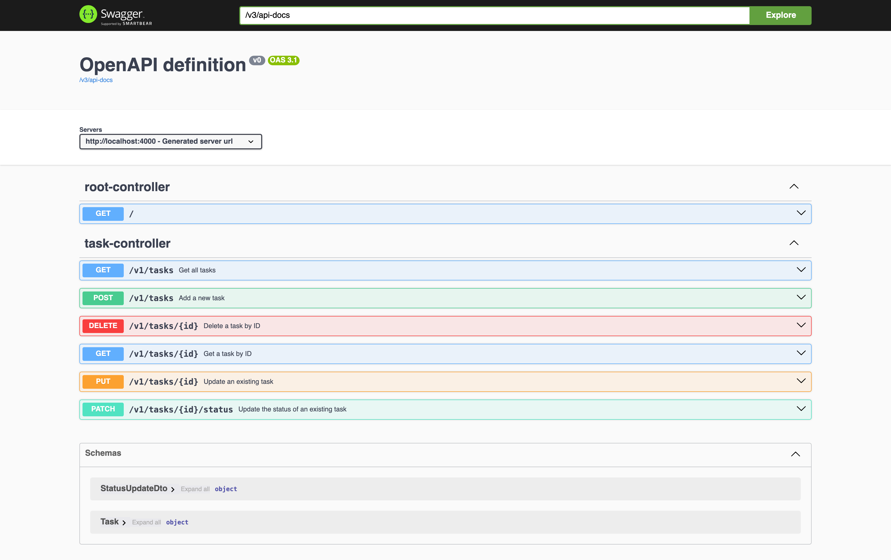

# Dev Test Backend



## Prerequisites

- Docker installed and running
- Java 21
- IDE with Lombok support
  - For IntelliJ: install the Lombok plugin and enable annotation processing — [learn more](https://bootify.io/next-steps/spring-boot-with-lombok.html)

---

## Build

```bash
./gradlew clean build
```

---

## Run the Application

```bash
./gradlew bootRun
```

When starting the application, `docker compose up` is run automatically.

> Docker must be running on the host to provide a Postgres instance.

### Access
- App: [`localhost:4000`](http://localhost:4000)
- Swagger UI: [`localhost:4000/swagger-ui/index.html`](http://localhost:4000/swagger-ui/index.html)

---

## Run Tests

All tests:
```bash
./gradlew test
```

Integration tests:
```bash
./gradlew integration
```

---

## Docker

The database is created and populated by [`./docker/init.sql`](./docker/init.sql).

Recreate the database:
```bash
docker compose down
docker volume rm dev-test-backend_pgdata
```
This removes all Postgres data, and seeds the DB from `init.sql`.

---

## Further Reading

- [Gradle User Manual](https://docs.gradle.org/)
- [Spring Boot Reference](https://docs.spring.io/spring-boot/docs/current/reference/htmlsingle/)
- [Spring Data JPA Reference](https://docs.spring.io/spring-data/jpa/reference/jpa.html)
- [Spring Boot Docker Compose](https://docs.spring.io/spring-boot/reference/features/dev-services.html#features.dev-services.docker-compose)
